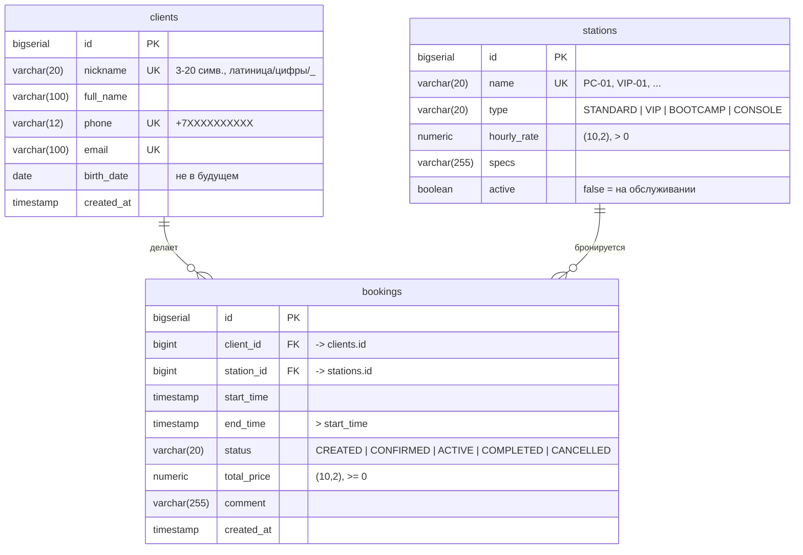
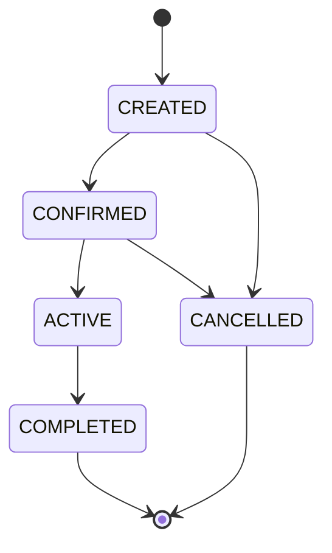

# ER-диаграмма базы данных `cyberclub`

Три связанные таблицы: клиент делает бронирования, каждое бронирование относится
к одному игровому месту. Схема — [`db/01_schema.sql`](../db/01_schema.sql),
готовое изображение — [`er-diagram.svg`](er-diagram.svg).

## Ограничения

| Ограничение | Таблица | Смысл |
|---|---|---|
| PRIMARY KEY `id` | все | суррогатный ключ, `BIGSERIAL` |
| FOREIGN KEY `client_id -> clients.id`, `station_id -> stations.id` | bookings | `ON DELETE RESTRICT`: нельзя удалить клиента или место, на которые есть ссылки |
| UNIQUE `nickname`, `phone`, `email` | clients | один клиент — один ник, телефон, email |
| UNIQUE `name` | stations | названия мест не повторяются |
| CHECK `chk_clients_nickname`, `chk_clients_phone`, `chk_clients_email`, `chk_clients_birth_date` | clients | форматы полей, дата рождения не в будущем |
| CHECK `chk_stations_type`, `chk_stations_rate` | stations | допустимые значения enum, тариф > 0 |
| CHECK `chk_bookings_status`, `chk_bookings_price`, `chk_bookings_time` | bookings | допустимые статусы, цена ≥ 0, конец позже начала |
| EXCLUDE `excl_bookings_overlap` (btree_gist) | bookings | две неотменённые брони одного места не могут пересекаться по времени |
| INDEX `start_time`, `status`, `client_id`, `station_id` | bookings | ускорение поиска, фильтрации и соединений |

Схема переходов статуса бронирования (enum `BookingStatus`):

